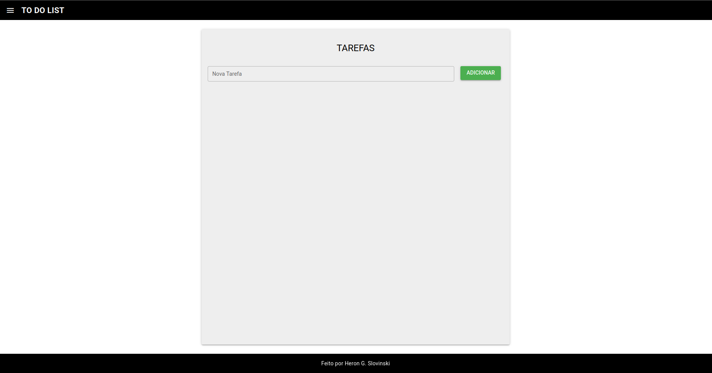
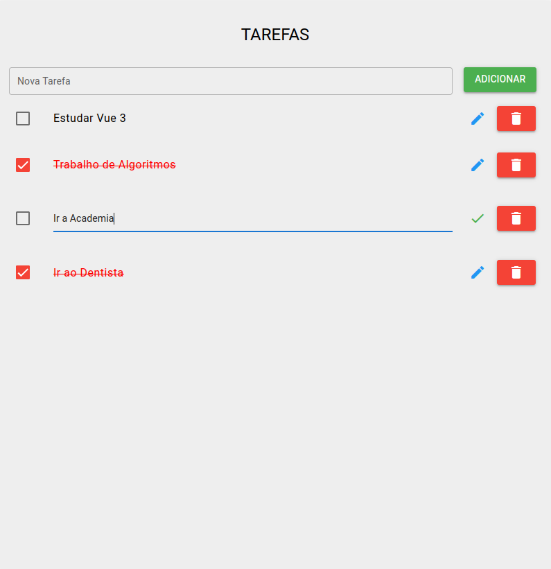
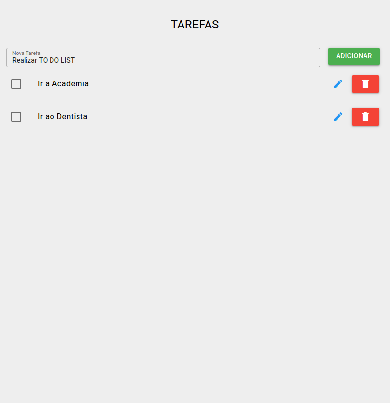
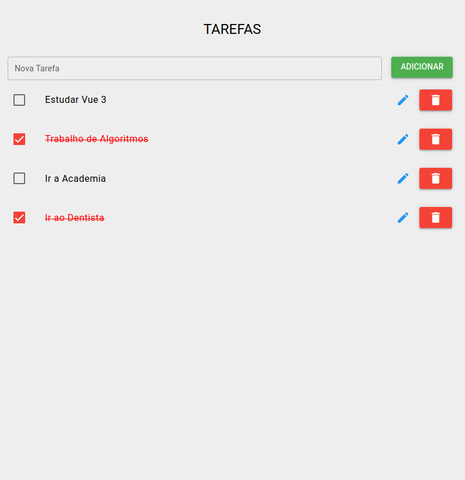

<h1 align="center"> To Do List Application </h1>

To Do List using Laravel, MySQL, Vue and Quasar.


## Descrição do Projeto

Aplicação To Do List desenvolvida como teste técnico e complementar ao processo seletivo para o cargo de Desenvoledor Full-Stack realizado com a Empresa SOFTPAR Software House.

### 📌 Funcionalidades do Projeto

- `Página Inicial`: Página Inicial da Aplicação To Do List onde são exibidas todas as tarefas disponíveis para serem realizadas.
  

- `Adicione novos Itens`: Adicione novas tarefas para serem realizadas através do input Novas Tarefas.


- `Edit os itens`: Edit os itens criados, atualizando o campo de nome.
 

- `Delete Itens`: Delete itens que não serão mais realizados
 

- `Marque Itens Concluídos`: Selecione os itens que já foram concluidos para poder realizar os próximos
-  

 ### 🖥️ Requisitos
 
* XAMPP <br>
* MySQL <br>
* PHP <br>
* Laravel <br>
* Vue <br>
* Quasar <br>

### 📁 Acesso ao projeto

* Na pasta desejada, e executar o comando:
```git
git clone https://github.com/herongs/app-todo-list.git
```
* Execute o aplicativo XAMPP:
```
Start MySQL
```
* Na pasta todo-list, execute no cmd:
```
php artisan migrate
```
* Na pasta todo-list, execute no cmd:
```
php artisan serve
```
* Na pasta quasar-project, execute no cmd:
```
quasar dev
```
